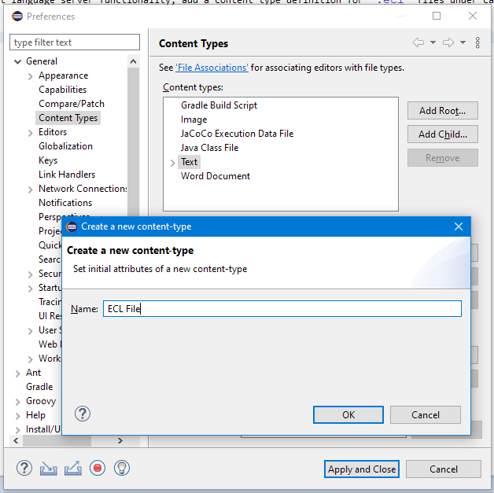
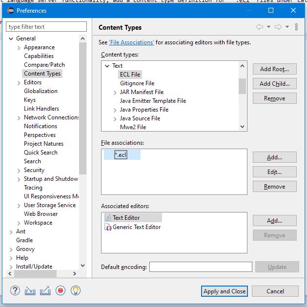
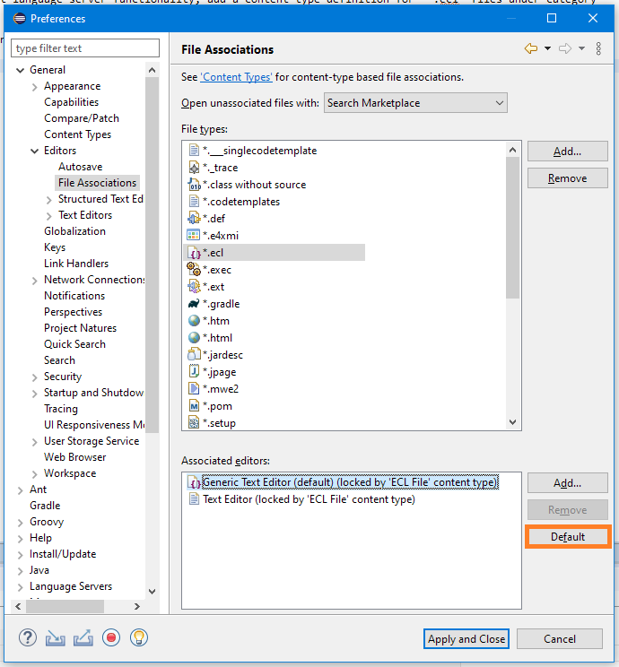
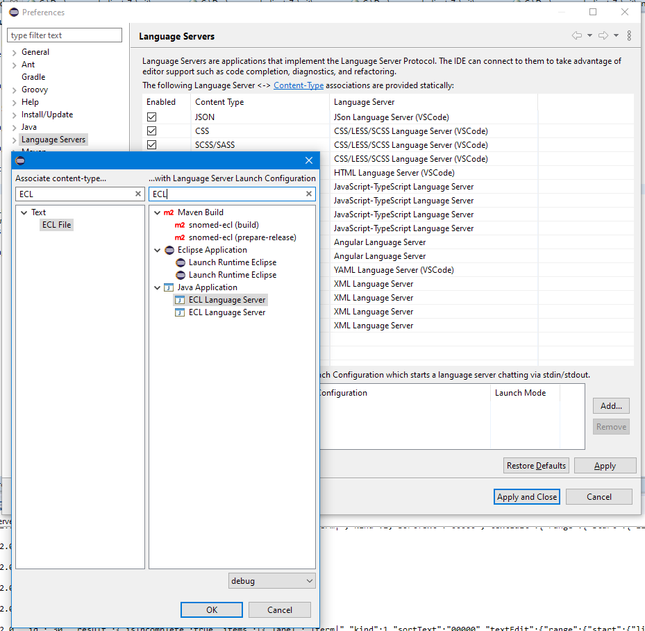
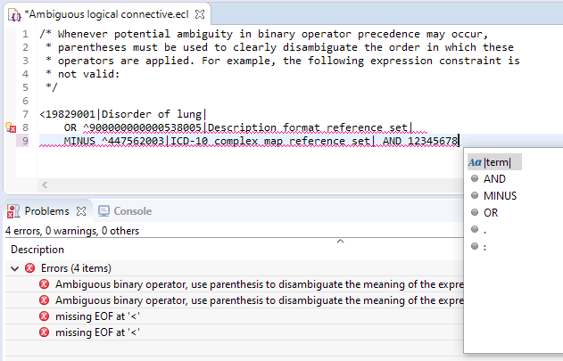

# Debugging and testing ECL language server in Eclipse

If you have a relatively recent installation of Eclipse, [LSP4E](https://projects.eclipse.org/projects/technology.lsp4e) 
is already installed. To test language server functionality, add a content type definition for "*.ecl" files under category
"Text":

 

Set "*.ecl" as the file extension, and add "Generic Text Editor" to the list of allowed editors...

...then set it as the default on page "File Associations":

In section "Language Servers", associate the shared Java application launch configuration file with ECL files:

Following this, when opening an ECL file, the external language server process should start, and if the launch configuration
was set to debug mode on the bottom of the page (see screenshot above), it can also be debugged. Project-level validation as
well as content assist features should start to appear in opened ECL editors:

As state is re-synchronized from the workspace after each launch, the server process can be stopped and re-started as 
necessary. Note that removing the launch configuration from the "Language Servers" page's bottom section will not stop a
running instance, and visiting problem markers created by the server may resurrect a stopped instance as well.
   